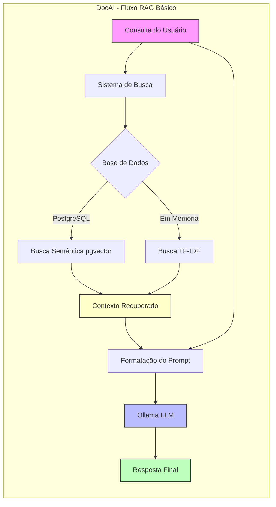
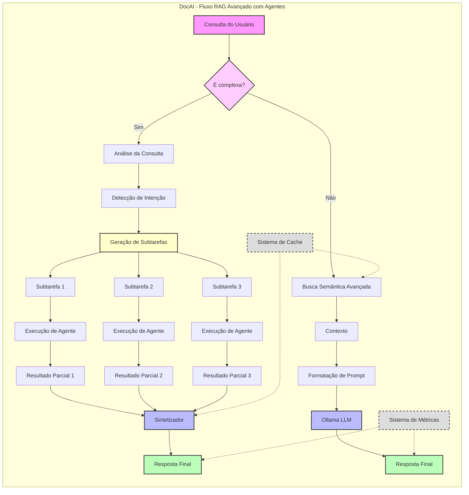
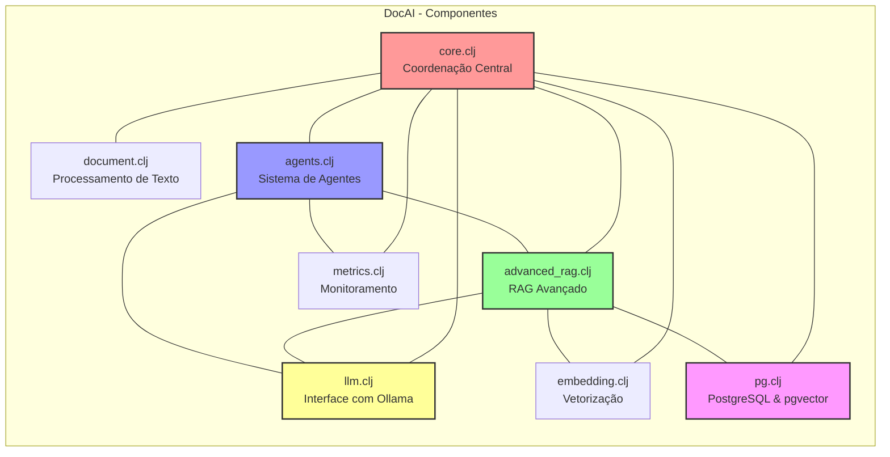
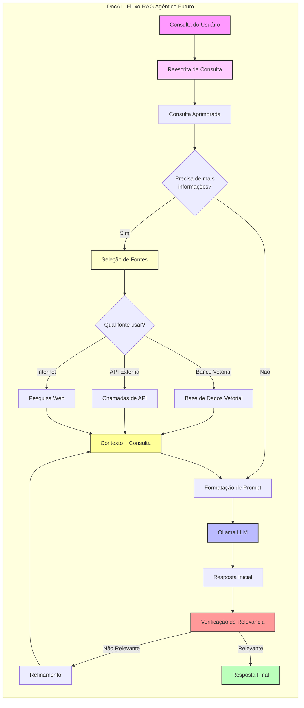
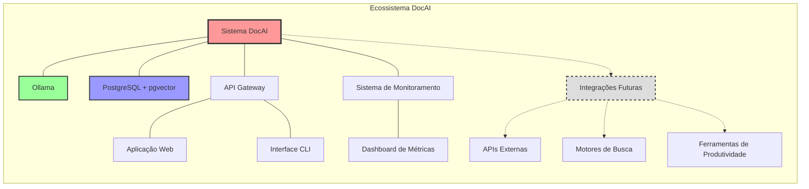

# DocAI - Assistente RAG para Documentação Técnica

Um sistema RAG (Retrieval Augmented Generation) em Clojure para consulta de documentação técnica com respostas contextualizadas.

## Características

- **Formatos suportados**: Markdown, HTML
- **Implementações**:
  1. **TF-IDF em memória**: Leve, sem dependências externas
  2. **PostgreSQL/pgvector**: Busca semântica escalável
  3. **RAG Avançado com Agentes**: Para consultas complexas
- **Recursos**: Chunking dinâmico, reranqueamento, cache multi-camada, monitoramento

## Pré-requisitos

- [Leiningen](https://leiningen.org/) 2.9.0+
- [Ollama](https://ollama.com/) (LLM deepseek-r1)
- [Docker](https://www.docker.com/) ou [Podman](https://podman.io/) (para PostgreSQL)

## Início Rápido

1. **Clone e configure**:
   ```bash
   git clone https://github.com/scovl/docai.git && cd docai
   
   # Linux
   chmod +x run.sh && ./run.sh setup
   # Windows
   run.bat setup
   ```

2. **Inicie os containers**:
   ```bash
   # Linux
   ./run.sh podman-start
   # Windows
   run.bat docker-start
   ```

3. **Coloque documentos** em `resources/docs/`

4. **Execute**:
   ```bash
   # Modo básico
   ./run.sh memory    # Linux
   run.bat memory     # Windows
   
   # Modo avançado
   ./run.sh advanced  # Linux
   run.bat advanced   # Windows
   ```

## Modos de Operação

### Scripts de Execução

**Linux** (`run.sh`) e **Windows** (`run.bat`) suportam:
- `memory` - Modo TF-IDF em memória
- `postgres` - Modo PostgreSQL com embeddings densos
- `advanced` - Modo RAG avançado com agentes
- `podman-start/docker-start` - Inicia containers
- `podman-stop/docker-stop` - Para containers
- `help` - Ajuda

### Lein Run (exemplos principais)

```bash
# Básico (TF-IDF em memória)
lein run

# PostgreSQL
lein run --postgres

# RAG avançado
lein run --advanced

# Consulta direta
lein run --advanced "Como implementar autenticação JWT?"

# Workflow com agentes
lein run --agents "Compare os algoritmos de hashing"

# Importar diretório
lein run --import path/to/directory

# Ver métricas
lein run --metrics 7
```

> Use `lein run --help` para ver todos os comandos

## Arquitetura

### Fluxos de Processamento

**Modo em memória (TF-IDF)**
```
Documento → Processador → TF-IDF → Similarity Search → LLM → Resposta
```

**Modo PostgreSQL**
```
Documento → PostgreSQL → pgai/pgvector → Busca Semântica → LLM → Resposta
```

**Modo RAG Avançado**
```
Consulta → Analisador → Workflow de Agentes → Documentos → 
Agentes (Pesquisa/Raciocínio) → Verificador → Sintetizador → Resposta
```

### Componentes PostgreSQL

- **Extensões**: pgvector, pgai
- **Tabelas**: documentos, documentos_embeddings
- **Benefícios**: Escalabilidade, busca semântica precisa, persistência

### Diagramas de Arquitetura

O DocAI implementa uma arquitetura modular e flexível que suporta diferentes modos de operação, desde busca simples baseada em [TF-IDF](https://en.wikipedia.org/wiki/Tf%E2%80%93idf) até workflows avançados com agentes. Os diagramas a seguir ilustram os principais fluxos de processamento e componentes do sistema.

O diagrama abaixo mostra o fluxo básico de Retrieval Augmented Generation (RAG) implementado no DocAI, que pode operar tanto com banco de dados PostgreSQL quanto com busca em memória:



O processo começa com uma consulta do usuário que é direcionada ao sistema de busca. Dependendo da configuração, o sistema pode utilizar o [PostgreSQL](https://www.postgresql.org/) com [pgvector](https://github.com/pgvector/pgvector) para busca semântica avançada ou uma abordagem mais simples baseada em [TF-IDF](https://en.wikipedia.org/wiki/Tf%E2%80%93idf) para busca em memória. 

Após a recuperação do contexto relevante, o sistema combina esse contexto com a consulta original para formatar um prompt adequado, que é então enviado ao modelo de linguagem Ollama para gerar a resposta final.

Este fluxo RAG básico representa a fundação do [DocAI](https://github.com/scovl/docai), oferecendo um equilíbrio entre precisão e eficiência. A flexibilidade na escolha do mecanismo de busca permite que o sistema se adapte a diferentes necessidades: o [PostgreSQL](https://www.postgresql.org/) com [pgvector](https://github.com/pgvector/pgvector) proporciona busca semântica mais precisa e escalabilidade para grandes bases de conhecimento, enquanto a opção em memória oferece maior velocidade para conjuntos de dados menores ou em ambientes com recursos limitados.


#### Fluxo RAG Avançado com Agentes

O diagrama abaixo ilustra o fluxo avançado de processamento de consultas no DocAI, incorporando técnicas de RAG (Retrieval Augmented Generation) com agentes inteligentes:



## Explicação do Fluxo RAG Avançado com Agentes

O diagrama acima ilustra o fluxo de processamento avançado do DocAI quando utiliza agentes para consultas complexas:

1. **Análise de Complexidade**: Ao receber uma consulta do usuário, o sistema primeiro determina se ela é complexa o suficiente para necessitar do pipeline com agentes.

2. **Consultas Simples**: Se a consulta for simples, ela é processada através da busca semântica avançada, que recupera o contexto relevante, formata o prompt e envia para o LLM gerar a resposta final.

3. **Consultas Complexas**: Para consultas complexas, o sistema:
   - Analisa a consulta para detectar a intenção do usuário
   - Decompõe o problema em subtarefas menores e mais gerenciáveis
   - Atribui cada subtarefa a um agente especializado
   - Executa os agentes em paralelo ou sequencialmente conforme necessário
   - Coleta os resultados parciais de cada agente
   - Sintetiza uma resposta final coerente a partir desses resultados

4. **Sistemas de Suporte**:
   - **Cache**: Armazena resultados de buscas e respostas anteriores para reduzir latência e custos
   - **Métricas**: Monitora o desempenho e a qualidade das respostas para análise contínua

Este fluxo permite que o DocAI aborde consultas complexas que exigem múltiplas etapas de raciocínio, busca de informações em diferentes fontes, ou processamento especializado, resultando em respostas mais precisas e completas.




## Desenvolvimento

```clojure
;; Ativar PostgreSQL no REPL
(reset! docai.core/use-postgres true)
(docai.pg/setup-pg-rag!)
(docai.core/import-docs-to-postgres)
```

**Ferramentas**: 
- Formatação: `lein cljfmt fix`
- Análise: `lein kibit`

## Próximos Passos e Melhorias

O DocAI está evoluindo para um sistema RAG Agêntico mais completo. Abaixo estão as principais melhorias planejadas:

### Fluxo RAG Agêntico Avançado (Planejado)

O diagrama abaixo ilustra o fluxo avançado de processamento de consultas no DocAI, incorporando técnicas de RAG (Retrieval Augmented Generation) com agentes inteligentes:

1. **Reescrita da Consulta**: A consulta original do usuário é analisada e reformulada para melhorar a precisão da recuperação.
2. **Avaliação de Necessidade**: O sistema determina se precisa buscar informações adicionais ou se pode responder diretamente.
3. **Seleção de Fontes**: Para consultas que necessitam de mais informações, um agente seleciona as fontes mais apropriadas:
   - Base de dados vetorial (conhecimento interno)
   - APIs externas (dados estruturados de serviços)
   - Pesquisa web (informações públicas atualizadas)
4. **Processamento de Contexto**: As informações recuperadas são combinadas com a consulta original.
5. **Geração de Resposta**: O LLM (Ollama) gera uma resposta inicial baseada no contexto e na consulta.
6. **Verificação de Qualidade**: Um agente crítico avalia a relevância e precisão da resposta.
7. **Refinamento Iterativo**: Se a resposta não for satisfatória, o sistema refina a busca e gera uma nova resposta.
8. **Entrega Final**: Quando a verificação é bem-sucedida, a resposta é entregue ao usuário.



Este fluxo representa uma evolução significativa em relação ao RAG básico, incorporando tomada de decisão autônoma, múltiplas fontes de dados e verificação de qualidade.

### Melhorias Específicas Planejadas

1. **Reescrita de Consultas**
   - Implementar um módulo de reformulação de consultas que melhore a precisão da busca
   - Expandir consultas muito curtas e focar consultas muito abrangentes

2. **Seleção Dinâmica de Fontes**
   - Ampliar o workflow de agentes para decidir quais fontes de informação consultar
   - Integrar com APIs externas e pesquisa web para consultas que não podem ser respondidas apenas pela base de conhecimento

3. **Verificação Avançada de Respostas**
   - Implementar um sistema de verificação mais robusto que valide fatos e relevância
   - Refinamento iterativo de respostas que não atendem aos critérios de qualidade

4. **Framework de Ferramentas para Agentes**
   - Desenvolver um sistema de ferramentas que permita aos agentes realizar ações específicas
   - Criar executores de código, calculadoras, formatadores e outras ferramentas especializadas

5. **Interface Multimodal**
   - Adicionar suporte para processamento de imagens e geração de gráficos/diagramas
   - Permitir entrada e saída em diversos formatos além de texto

### Integração com o Ecossistema



## Solução de Problemas

- **PostgreSQL inacessível**: Verifique containers e porta 5432
- **Erros next.jdbc**: Confirme versão 1.3.1002
- **Modelos ausentes**: Execute `ollama list`

## Ambiente Contêiner

O projeto suporta Docker (Windows) e Podman (Linux) via variável `CONTAINER_ENGINE`.

## Licença

[Eclipse Public License 2.0](https://www.eclipse.org/legal/epl-2.0/)
